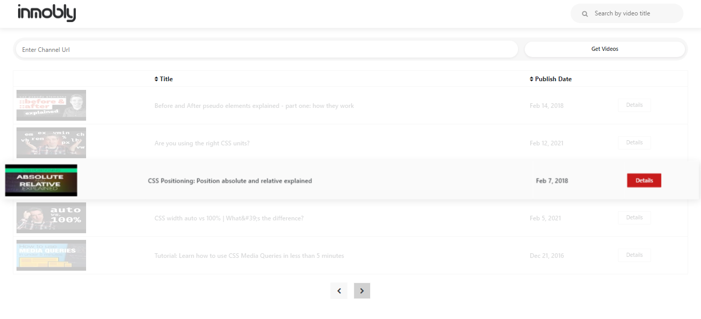

# YoutubeApiTask

This project was generated with [Angular CLI](https://github.com/angular/angular-cli) version 11.1.0.

# Description.
## Home page


- This is a simple project implemented with angular 11 and integrating with youtube's official api. The home page displays the videos of a specific channel.
- Videos can be ordered by title or date.
- There is a search functionality by title.
- Channel can be set by typing the channel's url to get the related videos.
- Videos are chached into local storage.

## Video Details


- Video details page displays full details of the selected video.
- Rating the video and add to favourites functionality integrating with firebase firestore sdk.
- [Live server link](https://fir-webapp-8001a.web.app/)

# About the project.
- CSS used libraries such as bootstrap https://getbootstrap.com/docs/5.0/getting-started/introduction/, fontawesome https://fontawesome.com/, angular-star-rating https://github.com/BioPhoton/angular-star-rating
- Firebase firestore SDK, and @angular/fire also used for deploying the project on firebase server.

# Project Setup.
```
npm install
ng serve
```
